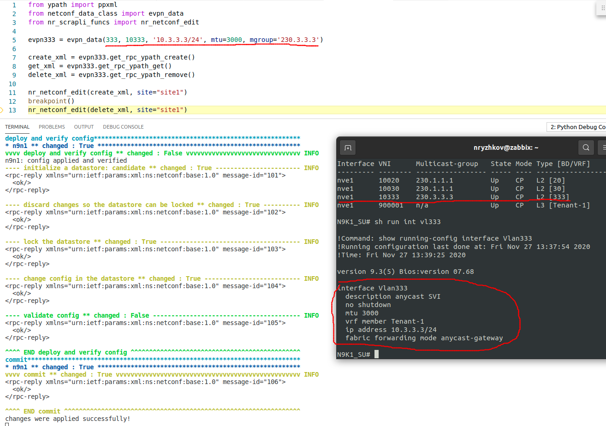

# NXOS NetConf XML RPC lab

This lab is intended to figure out how to interract with NXOS switched via netconf

The goal is to craft and test RPCs that can be used in the evpn fabric controller (nxos only) that I plan to implement in the future


The tricky part is to dig around YANG models. There are three utilities that helps a lot:  
1. [pyang](https://github.com/mbj4668/pyang)
2. [gnmic prompt mode](https://gnmic.kmrd.dev/advanced/prompt_suggestions/)
3. [yang path explorer](https://github.com/hellt/yangpath)


## 1. Crafting RPCs

### 1.1 XML templates

the xml templates are located in the **tpl_evpn_xml.py** file

### 1.2 ypath method

I already have mentioned gnmic and yangpath tools above.   
They are pretty usefull to dig inside the particular YANG model  
The result is a path-like string separated with slashes. I called this format *ypath*  
This is one of the example:  
```bash
/System/ipv4-items/inst-items/dom-items/Dom-list/name=default/if-items/If-list/id=vlan333
```
Netconf needs XML though. So I wrote a function and some wrappers to help transforms that ypath into XML
```python
from ypath import ypath2xml, ppxml
xmlns = "http://cisco.com/ns/yang/cisco-nx-os-device"
ypath = '/System/ipv4-items/inst-items/dom-items/Dom-list/name=default/if-items/If-list/id=vlan333'
ppxml(ypath2xml(ypath, xmlns))
```
```bash
<System xmlns="http://cisco.com/ns/yang/cisco-nx-os-device">
    <ipv4-items>
        <inst-items>
            <dom-items>
                <Dom-list>
                    <name>default</name>
                    <if-items>
                        <If-list>
                            <id>vlan333</id>
                        </If-list>
                    </if-items>
                </Dom-list>
            </dom-items>
        </inst-items>
    </ipv4-items>
</System>
```


## 2. Put RPCs into devices

### 2.1 scarpli_netconf

I love scrapli (I've used it in my repo rocket.bot and I like it)  
So the [scrapli_netconf](https://github.com/scrapli/scrapli_netconf) was the first thing I thought of when I started to play with Netconf

example: [play_scraply_netconf.py](play_scraply_netconf.py)

### 2.2 nornir_scrapli

Ok lets assume we need to configure not a switch but a service.  
This means you have to configure a couple of devices at once. Plus you have to implement a transactional model so if one of the devices fails all the ongoing changes has to be rolled back.  
the Nornir library could be pretty usefull. And surprise-surprise there is the scrapli plugin again: [nornir_scrapli](https://github.com/scrapli/nornir_scrapli)

the file [nr_scraply_funcs](nr_scrapli_funcs.py) contains the function where I tried to implement the transactional model

and it seems to work:

*[create_evpn.py](create_evpn.py) file is running*


