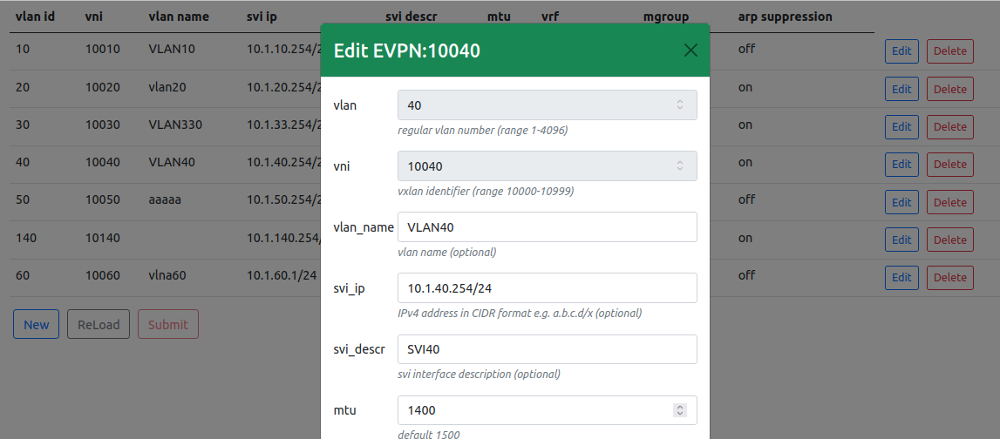
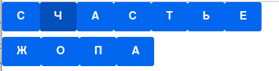

# React App practice 
playing around with react tutorial from [React Tutorial: An Overview and Walkthrough
By Tania Rascia](https://www.taniarascia.com/getting-started-with-react/)

there two independent applications:  
1. App.js - a beutiful Form to create vxlan/evpn vni with anycast svi  

  

2. Aaa.js - is a gamelike app to shuffle letters   

  
  

***Note: edit last line in index.js to switch between apps***
